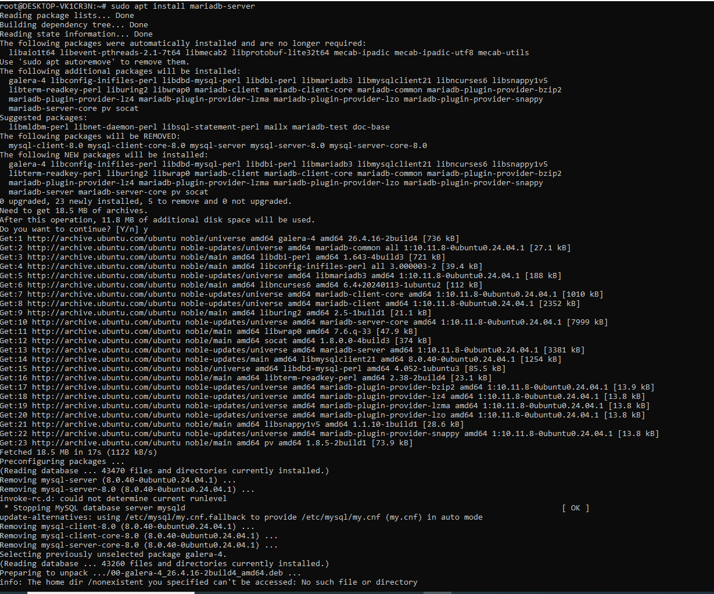

# PostgreSQL and MySQL Database Administration Portfolio

## Overview
This portfolio showcases my experience as a database administrator working with both PostgreSQL and MySQL databases. The focus is on essential DBA tasks such as database provisioning, configuration, recovery, indexing, storage engines, and the automation of routine tasks. I perform these tasks using the **tolldata** database for PostgreSQL and the **billing** database for MySQL, leveraging various techniques including automated backups, recovery strategies, and crash simulations.

## Objectives
This project aims to achieve the following:
1. **Installing/Provisioning**: Set up PostgreSQL and MySQL servers on a Linux-based environment.
2. **Configuration**: Tune the configuration files for performance, security, and reliability.
3. **Recovery**: Perform database crash simulations and validate recovery processes.
4. **Indexing**: Implement indexing strategies to improve query performance on both databases.
5. **Storage Engines**: Explore and configure MySQL's InnoDB engine and PostgreSQL’s native storage system for optimized storage.
6. **Automation of Routine Tasks**: Automate backup and restoration processes using scripts and schedule them with cron jobs.

## Technologies Used
- **Operating System**: Ubuntu 22.04
- **Databases**: PostgreSQL, MySQL
- **Backup Tools**: `pg_dump`, `mysqldump`
- **Automation**: Cron jobs for scheduling backups
- **Crash Recovery**: Simulated database crash and recovery using backups
- **Indexing Tools**: PostgreSQL Indexes, MySQL Indexing
- **Storage Engines**: InnoDB (MySQL), PostgreSQL's native storage engine
- **Scripting**: Bash scripts for backups and restores

## Portfolio Structure
    DB-Admin-Portfolio/
    ├── installation/
    │   ├── install_postgresql.sh
    │   ├── install_mysql.sh
    ├── configuration/
    │   ├── postgresql.conf
    │   ├── my.cnf
    ├── user_management/
    │   ├── user_guide.md
    │   ├── create_roles.sql
    │   ├── assign_permissions.sql
    ├── indexing/
    │   ├── create_indexes_postgresql.sql
    │   ├── create_indexes_mysql.sql
    ├── backup/
    │   ├── backup_guide.md
    │   ├── backup_script.sh
    │   ├── restore_s
    ├── automation/
    │   ├── backup_postgresql.sh
    │   ├── backup_mysql.sh
    │   ├── cron_jobs.md
    ├── crash_simulation/
    │   ├── simulate_postgresql_crash.sh
    │   ├── simulate_mysql_crash.sh
    ├── recovery/
    │   ├── postgresql_recovery.sh
    │   ├── mysql_recovery.sh
    ├── images/
    │   ├── postgresql_backup_success.png
    │   ├── mysql_backup_success.png
    │   ├── recovery_success.png

## Implementation Steps  
### 1. Installing/Provisioning  
**Steps**:  
- I installed MySQL and PostgreSQL servers on a WSL Ubuntu environment.
  
***For Mysql***
To install Mysql Server into my WSL Ubuntu environment, I gave the following command into my terminal
-  Update the package index:
```bash
 sudo apt update
```



- I provisioned two databases:  
  - PostgreSQL: `tolldata`  
  - MySQL: `billing`  

**Deliverables**:  
- I created shell scripts `install_postgresql.sh` and `install_mysql.sh` to automate the installations.
  
    sudo apt update


    
    
    
    
    
    
    
    


